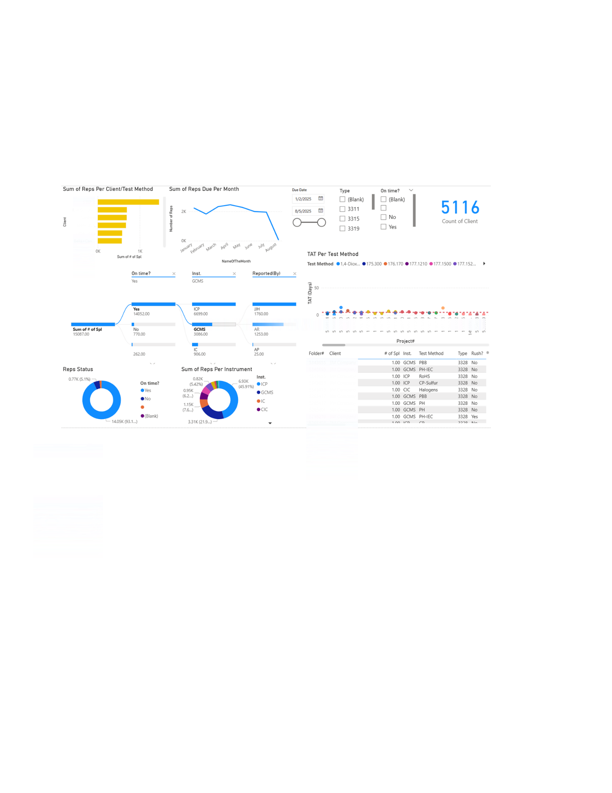

# SQL & Power BI Lab Projects

This project includes two data analysis case studies using SQL and Power BI, focused on improving internal workflows.  
One analysis focuses on lab sample processing, and the other on internal task handling between departments.

---

## Projects Included

### Lab Data Analysis
- Analyzed turnaround time (TAT)
- Identified delays by client, method, and instrument
- Tracked staff workload in prep, extraction, and reporting
- Visualized weekly trends of sample intake

### Internal Task Workflow
- Measured task completion times
- Analyzed employee workload distribution
- Compared rush jobs vs. normal jobs
- Visualized task throughput and bottlenecks

---

## Folder Structure

| Folder/File | Description |
|-------------|-------------|
| `dashboard_screenshots/` | Visual snapshots of the dashboards |
| `dashboard_explanations/` | General explanation of each dashboard |
| `dax_codes_and_explanations/` | DAX logic with explanations and purpose |
| `queries/` | SQL scripts used in the analysis |
| `sql_result_screenshots/` | Screenshots of query outputs |
| `model_documentation/` | Power BI data model, relationships, and rationale |
| `README.md` | Project overview (this file) |

---

## Power BI Dashboards

### Lab Data Dashboard  

### Internal Task Workflow Dashboard  

---

## Tools Used

- Power BI for dashboards and visual analysis
- DAX for calculated columns and KPIs
- PostgreSQL for writing and running SQL queries
- Excel as a supporting data source

---

